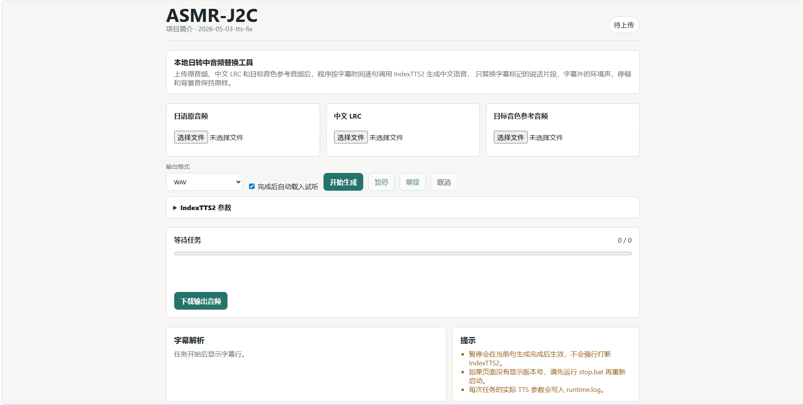

# ASMR-J2C

将日语原音频中中文 LRC 字幕标记的说话片段替换为中文 TTS 语音的本地工具。

## 功能

- 上传日语原音频、中文 LRC 字幕和目标音色参考音频。
- 按 LRC 时间逐句调用本地 IndexTTS2 生成中文语音。
- 支持IndexTTS2情绪控制、参数调整。
- 替换字幕有效时间段内的原声，字幕外的环境声、停顿和背景音保持原样。
- 对生成语音做响度平衡和时长适配，输出完整 WAV/MP3 音频。

## 截图


## 依赖

- **Python 3.11+**
- **ffmpeg**（需加入系统 PATH）
- **IndexTTS2** 服务（本项目需要配合 [IndexTTS2](https://github.com/index-tts/index-tts) 服务使用。）

## 快速开始

1. 克隆或下载本仓库。
2. 双击 `start.bat` 启动 Web 服务（首次运行会自动创建虚拟环境并安装依赖）。
3. 浏览器访问 `http://127.0.0.1:7861`。
4. 上传音频和字幕，调整 TTS 参数，点击“开始生成”。

> 如需停止服务，双击 `stop.bat` 或按 Ctrl+C。

## 配置 TTS 服务地址

在 Web 界面中展开“IndexTTS2 参数”，可自定义 IndexTTS2 服务地址（例如 `http://127.0.0.1:7861`），地址会自动保存。

## 项目结构

```
ASMR-J2C/
├── app/               # 后端代码
│   ├── main.py        # FastAPI 主入口
│   ├── jobs.py        # 任务队列与处理
│   ├── tts.py         # IndexTTS2 客户端
│   ├── lrc.py         # LRC 解析
│   ├── audio.py       # 音频处理
│   └── config.py      # 配置
├── static/            # 前端页面
│   ├── index.html
│   ├── app.js
│   └── styles.css
├── requirements.txt   # Python 依赖
├── start.bat          # 启动脚本（Windows）
├── stop.bat           # 停止脚本（Windows）
└── README.md
```

## 环境变量（可选）

- `INDEXTTS2_BASE_URL` – IndexTTS2 服务地址（默认 `http://127.0.0.1:7860`），可在前端页面自行修改地址端口。
- 其他参数见 `app/config.py`

## 注意事项

- 请确保 IndexTTS2 服务在启动本工具之前已经运行。
- 生成任务会占用较多内存和 CPU，建议在有独立显卡的机器上运行。
- 首次启动时会自动下载 Python 依赖（约 100MB），请耐心等待。

## 开源协议

[](https://www.gnu.org/licenses/gpl-3.0)
